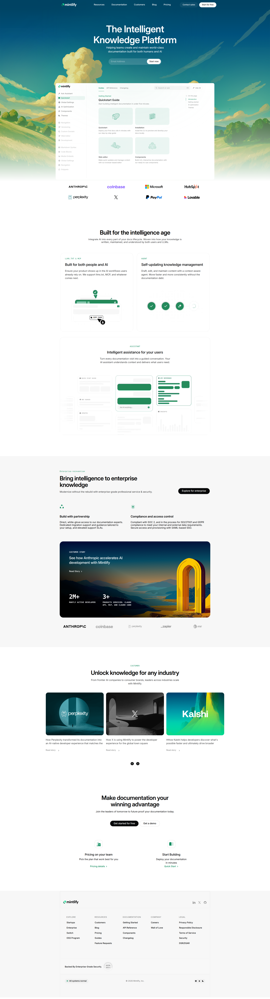

# Mintlify Clone - HTML & CSS

# Live Demo

https://chamollamohit.github.io/web-dev-2026-assignments/mintlify/

# 📸 Preview

## Sections Recreated

1. Top Navigation Bar
2. Hero Section
3. Documentation Preview Section
4. Trusted By / Logos
5. Feature Highlights
6. Intelligent Assistant / UI Preview
7. Enterprise Features Section
8. Case Studies / Customer Stories
9. Final Call-To-Action
10. Footer

---

## Fonts

| Font               | Usage                                      | Source                                                                            |
| ------------------ | ------------------------------------------ | --------------------------------------------------------------------------------- |
| **Inter Variable** | Primary UI and body text (weights 100–900) | `https://www.mintlify.com/_next/static/media/InterVariable-s.p.494bb210.ttf`      |
| **Mintlify Sans**  | Optional brand/display (weights 400–700)   | `https://www.mintlify.com/_next/static/media/797e433ab948586e-s.p.dbea232f.woff2` |
| **Geist Mono**     | Code and monospace elements                | `/fonts/GeistMono-Regular.ttf` (local)                                            |

---

## Colors

### Core palette

| Variable                    | Value                 | Use                                |
| --------------------------- | --------------------- | ---------------------------------- |
| `--color-background-main`   | `#fff`                | Page background                    |
| `--color-background-invert` | `#08090a`             | Dark surfaces                      |
| `--color-text-main`         | `#fff`                | Primary text on dark (e.g. hero)   |
| `--color-text-invert`       | `#08090a`             | Primary text on light              |
| `--color-text-soft`         | `rgba(8, 9, 10, 0.8)` | Secondary text                     |
| `--color-text-sub`          | `rgba(8, 9, 10, 0.6)` | Muted text                         |
| `--color-muted`             | `rgba(8, 9, 10, 0.5)` | Low-emphasis text                  |
| `--color-brand`             | `#0c8c5e`             | Mint green — CTAs, badges, accents |
| `--color-brand-light`       | `#0c8c5e`             | Same as brand                      |
